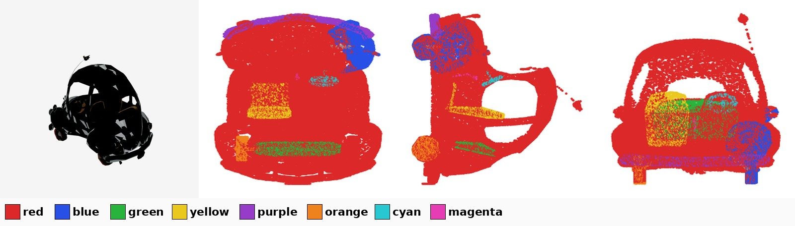

# semantic-parts

**Turn a flat 3D part segmentation into editable semantic parts.**

P3-SAM (or any part segmenter) gives you a *flat* set of part ids. That is not
an edit unit. An eye lives **inside** a head; a head is often several nested
shells; one smooth surface routinely gets cut into two ids. Move the "head" and
the eyes stay behind.

This repo is the layer that fixes that — geometry first, then one VLM call for
naming, then legality checks before you actually edit.

```
P3-SAM flat parts
   -> [geometry]  containment / nested shells / seams      part_tree.py
   -> [VLM]       one call: group AND name                 vlm_group.py
   -> [legality]  symmetry + floater closure, area gates   unit_legality.py
   -> edit units you can delete / move / retexture safely
```

The split is deliberate: **geometry handles what a VLM cannot SEE** (hidden
interiors, double walls, seams); **the VLM handles what geometry cannot KNOW**
(this is a rider, that is the dragon).

---

## Install & run

```bash
pip install numpy scipy trimesh libigl pillow matplotlib   # + vllm for naming
```

```bash
# CPU — part tree + the colour panel the VLM will read
python pipeline.py geom mesh.glb face_ids.npy out/ --photo render.png

# GPU — one VLM call -> out/units.json
#   {"object": "helicopter", "units": {"rotor blades": [23,26,68], "cockpit": [...]}}
python pipeline.py name out/

# CPU, optional — make one named unit legal to DELETE
python pipeline.py legalize out/ "wings"
```

Library form:

```python
from part_tree import build_part_tree
out = build_part_tree(mesh.vertices, mesh.faces, face_ids)
out["group"]["7"]     # -> [7, 12, 31]   the co-move set — THIS is the edit unit
```

`face_ids` is a `(F,)` int array, one part id per face, in the same face order
as the mesh you pass in.

---

## 1 · Geometry layer (`part_tree.py`)

| mechanism | recovers | criterion |
|---|---|---|
| **containment** (generalized winding number) | parts hidden INSIDE another — eyes in a head, mechanism in a shell | `\|w\| > 0.5` for ≥55% of the small part's surface samples |
| **nested-shell clustering** | one semantic solid modelled as several hugging shells | contact ≥0.35 **or** bbox-IoU ≥0.50 (rel. to smaller box) |
| **tangent-continuity seam merge** | one surface cut into two ids | median normal angle across the shared rim < 22° |

**Why the *generalized* winding number:** it stays meaningful for open /
non-watertight shells, which is the normal case for scanned and game assets. A
head that is an open shell still "contains" the eyeballs; a plain inside/outside
test fails there.

**What deliberately does NOT merge:** a head touching a body only at a neck ring
(low contact), and parts meeting at a concave crease (normals disagree). Real
joints survive — that is the point.

Output:

```
tree    {pid: {"parent": pid|-1, "rule": "inside"|"attached"|None, "score": f}}
cluster {pid: cluster_root_pid}       # co-moving shells (union-find)
group   {pid: [pid, ...]}             # part + descendants + cluster  <- use this
```

### Real example

`115e61fa` (a small car, 18 P3-SAM parts):

```
18 parts -> 14 clusters | 7 inside + 3 attached
   part  20 --inside(1.00)--> 52      part  63 --inside(1.00)--> 52
   part  22 --inside(1.00)--> 52      part  79 --inside(0.98)--> 52
   part 297 --inside(1.00)--> 52      part 101 --inside(0.76)--> 52
   part  41 --inside(0.77)--> 52
   part 146 --attached(1.00)--> 52    part  86 --attached(0.56)--> 52
   part   8 --attached(0.54)--> 52
   largest edit unit: part 52 -> 11 parts
```

Part 52 is the body shell; the seven `inside` parts are interior geometry you
cannot see from outside (seats, steering wheel, dashboard). Delete part 52 with
`group["52"]` and the interior rides along. Take part 52 alone and you get a
hollow car with furniture floating in mid-air.

Across 40 assets, **24 showed non-trivial structure** — this is the common case,
not an edge case.

---

## 2 · VLM layer (`color_panel.py` + `vlm_group.py`)

One call does **grouping and naming together**, and the model answers in
**colour names**, never part indices:



```
panel.jpg (photo | painted views | legend) + "available colors: red, blue, ..."
  -> {"object": "helicopter",
      "groups": [{"name": "rotor blades", "colors": ["red","cyan"]}, ...]}
  -> resolve_groups()  ->  {"rotor blades": [23, 26, 68], ...}
```

Four design choices, each of which cost a debugging round:

- **group + name in ONE call.** Split them and the model names things it never
  committed to grouping; the two answers drift.
- **answer in colours, not ids.** A VLM cannot address an integer it cannot see.
  `colors.json` resolves colour → pids machine-side, so the answer is
  unambiguous by construction.
- **paint solid clusters; do NOT show raw point scatter with an index legend.**
  An earlier version did and mislabelled a jaw as "backrest".
- **include a real render** next to the painted views. Grouping is a semantic
  judgement — the model needs to know it is a dragon, not a pile of blobs.

Guided/structured JSON decoding (vLLM `StructuredOutputsParams`) is not optional
at scale: free-form JSON from a 27B model fails to parse often enough to matter.
Reference model: Qwen3.6-27B. `color_panel.py` ships a zero-dependency point
renderer; pass your own callable for solid shaded views.

---

## 3 · Legality layer (`unit_legality.py`)

Naming gives you *a* set of parts. Deleting it can still be illegal. Three
geometric closures, no VLM:

- **symmetry closure** — for plural/paired concepts (wings, ears, legs, pipes),
  mirror the unit across the object's best symmetry plane and pull in the twin.
  Real case: a dragonfly's "wings" came back with **1 of 4** wings; closure
  recovered the other three. *"remove the wings" deleting only the left one* is
  the classic failure this prevents.
- **floater closure** — anything the deletion would leave disconnected from the
  main body joins the deletion set (feet that only hang off the legs).
- **area gates** — reject if the deletion takes >55% of the surface or leaves
  <30%. On an 11-unit pilot this rejected 6 units that were bad removal targets
  to begin with (a "head" that actually covered head + torso + limbs).

**Closure fixes under-selection but faithfully amplifies mis-selection.** For the
other half, render the closed unit highlighted and ask the VLM two *separate*
questions — *complete* (covers ALL of the named part?) and *exact* (covers ONLY
it?). On our pilot that flagged `wings` as "wings **and antennae**" — correct,
and invisible to us by eye.

---

## Running P3-SAM at scale

See [`P3SAM_NOTES.md`](P3SAM_NOTES.md). Short version: the stock
`demo/auto_mask.py` **discards its results** when `--save_mid_res 0` and dies on
the first bad mesh, and heavy assets collapse throughput from ~34 to ~6
assets/min. The notes list the patches for both.

## ⚠️ Provenance — the trap that cost us the most

**Load the mesh with the SAME loader that produced your `face_ids`.** Blender
evaluates armatures (posed geometry); trimesh ignores the skeleton and returns
bind pose. For the *same* `.glb` the two disagree, and every downstream index
then points at the wrong geometry — silently, with no error anywhere. We lost
days to this. One loader, one load, all the way through.

## Provenance of the code

Extracted from a production 3D-editing data engine, where adding this layer
moved part-removal from 9/10 to 12/12 and part-addition from 6/10 to 11/12 on a
12-task pilot. The failure it fixes is very concrete: *"move the head" used to
leave the eyes behind.*

## License

MIT
